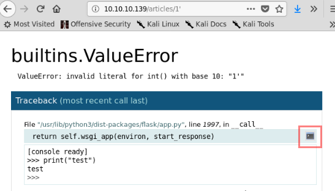

# Hack The Box - Ellignson


### <u>Port Scan</u>

We will start with a **nmap** to scan for open ports with the following command:

```bash
~$ nmap -sV -sC -p- 10.10.10.139
```


### <u>Web Enumeration</u>

When we enter the website we didn't see anything special except that there are 3 links to some articles.


### <u>Misconfiguration: Debug Mode Enabled</u>

When we inject a non-numeric character into the url, the web page shows us an error and we enter a debug mode normally used in development environments.


This debug mode allow us to execute commands in the machine if we click on the console icon on the right side.



The first thing we do after discovering the code execution is to check what user is running the web application and if we are able to write a public key in "***authorized_keys***" file his home directory to access the machine by SSH.

```python
import os
os.popen('id').read()
```


After check the user that running the web application we are going to check the ssh configuration file.

```python
import os
os.popen('cat /etc/ssh/sshd_config').read()
```


The ssh configuration file tell us that we can put our ssh public key in "***authorized_keys***" or in "***authorized_keys2***" file to be able to enter in the remote machine by SSH.

In this case we are going to use "***authorized_keys2***" file.

```python
import os
os.popen('echo "<YOUR_PUBLIC_KEY>" >> ~/.ssh/authorized_keys2').read()
```


### <u>Lateral Movement - User Flag</u>

When we enter bya SSH with Hal user we don't see any flag so we'll probably have to make a lateral movement to get the flag.

The first thing that calls our attention is that the user **hal** belongs to the ***adm*** group. 


In Linux systems the users of this group are usually able to read the log files, so the first thing we decide to do is to look for all the files that the ***adm*** group can read with the following command:

```bash
~$ find / -group adm 2>/dev/null
```


We found an interested file called "**/var/backups/shadow.bak**" which contains the actual password in encrypted format. 

To crack these hashes we will execute the following command:

```bash
~$ hashcat -m 1800 -a 0 ellingson-hashes.txt /usr/share/wordlists/rockyou.txt
```


After a few minutes we will get the password (***iamgod$08***) from **margo** so we can enter by SSH and read the user flag.


### <u>Privilege Escalation</u>

One of the first things that we can do to privilege escalation it is to check if there are any SUID binaries that allow us to execute commands as root user. 

To check what binaries there are in the system we will use the following command:

```bash
~$ find / -perm -u=s 2>/dev/null
```


When we execute the "**garbage**" binary it ask us for a password that can be found searching for the strings in the binary.

```bash
~$ strings /usr/bin/garbage
```


The binary doesn't do anything special so the next step is to try to look for any memory corruptions.

Before download the binary we are going to generate a large string to test if there are any  buffer overflow vulnerability in the user input.

```
~$ python -c "print 'A' *200 "
~$ garbage
Enter access password: <PASTE_YOUR_STRING>
```


After check that the binary looks vulnerable to buffer overflow we are going to do some checks before exploit the vulnerability:

1. Check if the system has ASLR enabled

   ```bash
   ~$ cat /proc/sys/kernel/randomize_va_space
   ```

   

2. Check if the binary is hardened

```bash
~$ rabin2 -I garbage
```


Seeing that ASLR is enabled and that binary has NX protection enabled we need to do the technique **ret2libc** in order to exploit this buffer overflow.

> There are many post explaining this technique so we aren't going to see how to develop the exploit here. 

After develop the [exploit](https://github.com/cynops/HackTheBox-Writeups/blob/master/Ellingson/garbage-exploit.py) we are be able to get a root shell and take the root flag.

