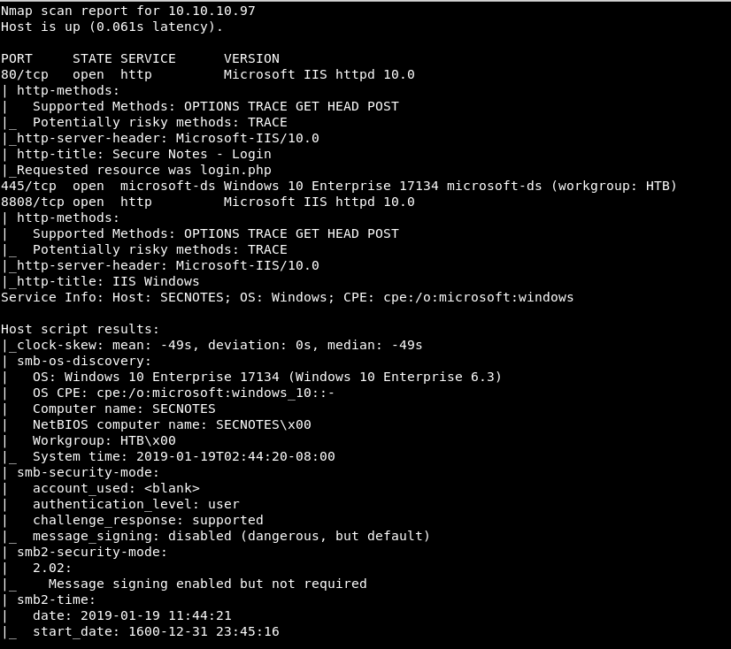
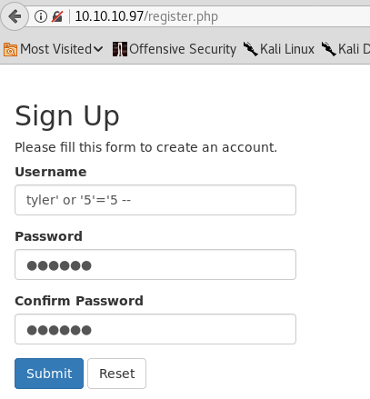
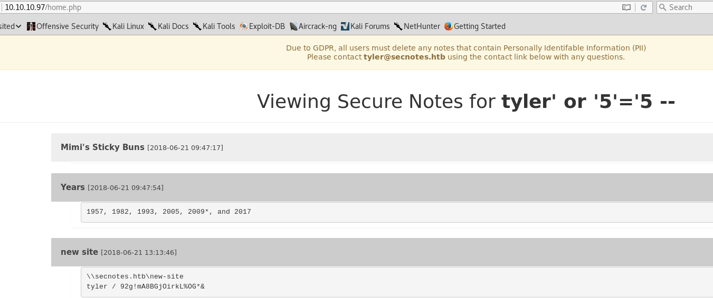
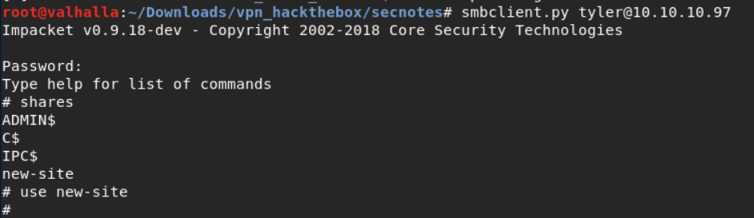
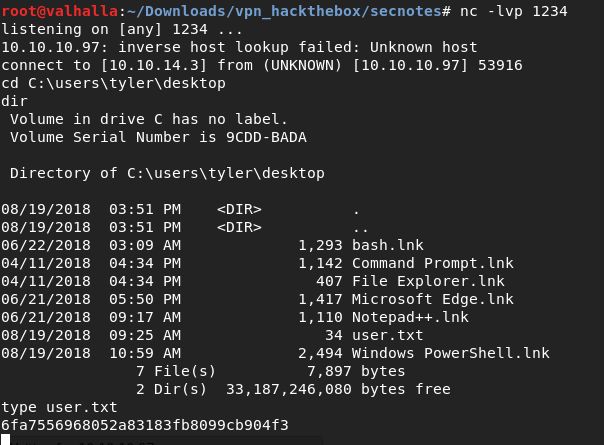
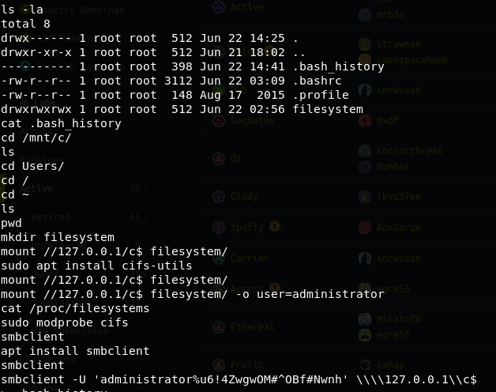
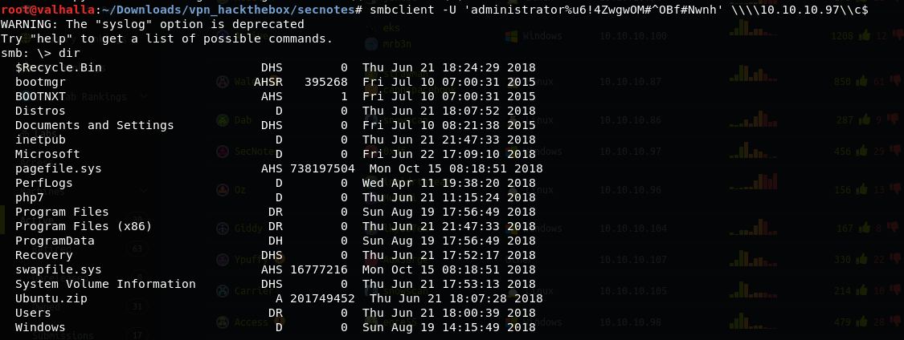
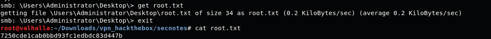

# HackTheBox SecNotes Writeup


### Enumeration

```
nmap -sC -sV -v -Pn -n -p- 10.10.10.97
```




### Explotation

The user registration form is vulnerable to SQLi so if we know a user we can register a user like ***user' or '5'='5 --*** to access to all their notes.

In this case we know that tyler user exists so we create a user with the following payload to access to all his notes.



In one of his notes we can see the tyler password to access to smb.



We access to the smb service with tyler credentials.



The **"new-site"** share has write privilege and corresponds with the http server on 8808 port so we can upload a php file to establish a reverse shell.



### Post Explotation

As you can see in the picture above there is a **"bash.lnk"** file. This file refers to a new feature in Windows 10 which allows you to run bash on this OS.

We will use the following command to find the bash executable:

```
dir /s bash.exe
```


Using the **"bash.exe"** file we enter in the bash subsystem and doing some enumeration we found the administrator user credentials in the **".bash_history"** file.



Knowing the credentials we can access to the administrator account and get the "**root.txt**" file.





